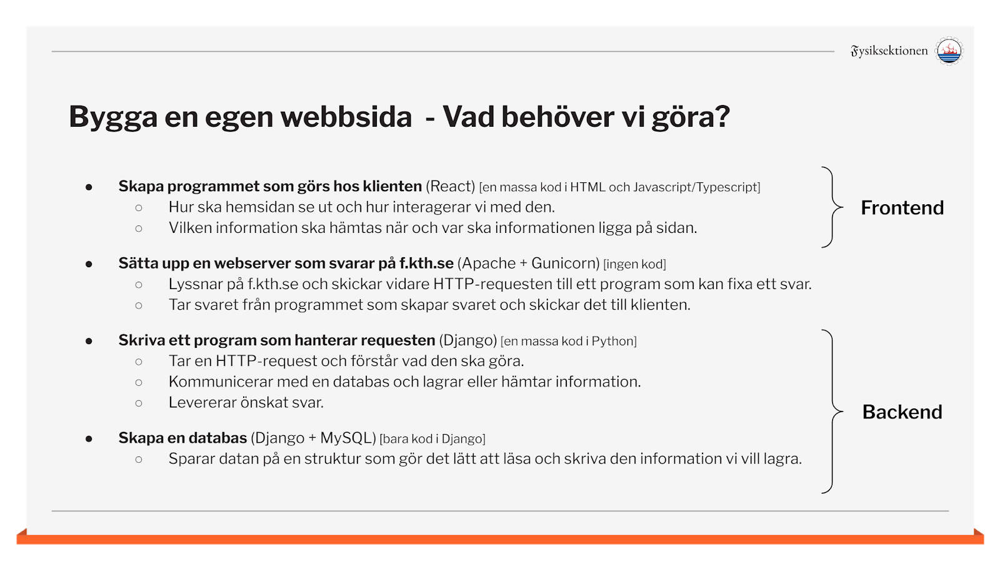

# Om projektet

Denna mapp (`/docs/`) är hela projektets dokumentation. Här finns allt som är värt att veta för att sätta sig in i 
projektet och hur det funkar på kod-nivå. Letar du efter information om hur du använder hemsidan? Se istället vår 
guide för användare här: [Guide till Fysiksektionens hemsida.](https://f.kth.se/).

## Introduktion
### Varför en ny hemsida?
Sektionen har ju en hemsida på f.kth.se. Denna bygger på det välkända verktyget Wordpress. Wordpress är ett 
verktyg/program som låter dig bygga upp en hemsida genom att importera paket med kod (teman/plugins) andra har 
skrivit. Med hjälp av dessa kan man bygga ut och anpassa sin sida efter de behov man har. Låter ju toppen, så varför 
byta?

Som det ser ut nu använder sektionen teman som är från långt tillbaka (ca.2012) och delvis är ihop-hackade av gamla 
fysiker och teknologer. Dessa teman är inte så anpassningsbara och det äs svårt för oss att lägga till eller ändra 
stora delar av beteendet.

Utöver ovanstående finns även andra vinster i att skriva en hemsida själv. Det är kul! Detta är självklart en stor 
anledning till att göra det. Delvis att det är kul för oss i stunden, men också en kul grej i framtiden att kunna 
säga att vi har skrivit vår egen hemsida. Något som vi på teknis är mer än kapabla till ; ) 

### Vad är målet?
Lite förenklat skulle vi kunna uttrycka målet som:

> Att bygga en hemsida med samma funktionalitet som hemsidan idag, men med möjlighet för enkel utbyggnad och anpassning.

Detta är såklart lite vagt, men det sammanfattar nog den riktning projektet har just nu. Vad detta innebär är att:
- De features som finns idag ska finnas på nya sidan (skapa sidor med dynamisk innehåll, nyheter och reklaminlägg, 
sätta rättigheter på sidor och ha inloggning, etc.)
- Koden ska skrivas på ett sätt som är dynamiskt och expanderbart. Vi ska tänka på framtiden och att de vill kunna 
  göra saker utan att börja om från grunden.
- Projektet ska vara väldokumenterat och tydligt. På så sätt uppfyller vi ordet “enkelt”.
- Systemet ska vara anpassningsbart, inte bara genom kod, utan genom att erbjuda anpassning för admin i en panel på 
  hemsidan.

Vi jobbar utefter följande designförslag: [Designförslag](https://xd.adobe.com/view/bdcc748c-ccff-45be-a60b-d262cbefcbbe-e89f/)

### Vilka jobbar på projektet?
Det är programmeringsgruppen F.dev som leder projektet. Tillsammans med F.com (kommunikationsnämnden) kommer de på 
hur olika saker ska se ut och fungera. I förlängningen tas även åsikter in från alla aktiva på sektionen.

## Hur funkar vår hemsida – Övergripande
Det här avsnittet handlar om hur allt hänger ihop, och framförallt hur vi kommunicerar mellan backend och frontend; 
det som kallas vår API.

### Hur byggs en hemsida?
För att hänga med på helhetsbilden av hur saker funkar på just vår hemsida är det viktigt att ha en grundläggande 
förståelse för hur det fungerar på en godtycklig hemsida. I presentationen nedan finner du en kort förklaring till 
hur det fungerar.

Presentation: [Hur funkar en hemsida?](https://docs.google.com/presentation/d/108EhkgI9oQ9c-gYYEzZpaNbk7iC9T2lgNGNW6eerLNw/edit#slide=id.gafa1e833d0_0_183)

Det är viktigt att du förstår allt i den presentationen på en basic nivå för att fortsätta. Gör du inte det? Be om 
hjälp!

#### En kommentar ang. namnen client/server och frontend/backend
Möjligen har du redan nu märkt att dessa namn används utbytbart i i princip alla sammanhang. Även om det i teorin 
finns lite skillnader är det inget som vi tar hänsyn till i vår kommunikation. Alltså, client ⇔ frontent  och  
server ⇔ backend.

### Vad behöver vi göra?
En sammanfattning av den kod som kommer behöva skrivas ges i den sista sidan av presentationen ovan. Den 
sammanfattar allt som det egentligen handlar om när det kommer till att bygga upp vår hemsida.

## Hur ser vårt API ut?
En hemsida måste ha en API som är välstrukturerad och tydlig, men viktigast av allt: nedskriven och överenskommen! 
Om det finns kan de som jobbar på front- respektive backenden jobba väldigt separat, med vetskapen om att den andra 
sidan kommer att skicka informationen på ett visst överenskommet format.

### Dokumentation
Vi dokumenterar vårt API med hjälp av dokumentationen i projektmappen `/docs/api-docs`. Denna mapp ska alltid hållas 
(minst) så uppdaterad som den API som levereras av servern.

API-dokumentationen ska uppfylla följande:
- Alla fält som skulle kunna returneras ska listas.
- Alla fält ska ha en datatyp associerad med sig.
- Det ska framgå om ett fält någonsin kan vara tomt.
- Eventuella GET-parametrar som kan förändra datan ska specificeras och förklaras.
- Både _request_ och _response_ ska specificeras.

### Typer av anrop
Att sammanfatta en hel API är svårt, men här förklaras den generella tanken bakom vår API. Förhoppningen är att det 
kan ge lite intuition för valet av URL:er till alla de anrop som finns.

#### Hämta/ändra objekt
En stor del av vad man gör med en hemsida är att hämta och ändra objekt som sparas i en databas, därför finns många 
API-adresser som näst intill direkt hämtar och ändrar saker i databasen. Dessa ligger oftast på adresser på formen:

| URL                       | Handling                     |
| --------------------------|:----------------------------:|
| /api/objektstyp           | listar alla objekt           |
| /api/objektstyp/objekt-id | hämtar/uppdaterar ett objekt |
| /api/objektstyp/create    | skapa nytt objekt            |

Exempel på objektstyper är: menus, pages, users, etc.

#### Utföra uppgifter på databasen
Ibland kan vi behöva utföra mer komplexa uppgifter på objekt. Därför finns det många API-anrop som finns till för att utföra dessa uppgifter. Dessa kan ligga på lite olika addresser, men oftas ligger de på adresser under den objektstyp som det berör och med en extra slug för att bestämma vilken uppgift det handlar om.

| URL                          | Handling                     |
| -----------------------------|:----------------------------:|
| /api/objektstyp/uppgiftsnamn | utför uppgift “uppgiftsnamn” |

		
### Vem bestämmer över vårt API
För att vi ska få en bra och tydlig API är det viktigt att vi försöker tänka igenom noggrant hur det ser ut och att 
det klarar av de features vi tänker oss. Så vem tänker då ut och beslutar om detta?

Svaret är att det gör vi alla tillsammans. Här är det viktigt att vi har god kommunikation både under och mellan 
våra större möten. Kanske är det någon på frontenden som måste börja skriva en massa komplexa funktioner för att 
vårt API inte passar för det den vill göra. Då är det viktigt att den personen tar upp det! Kanske kommer vi ändå 
fram till att det får vara så, eller så är det lätt åtgärdat på backenden och vi får en renare och tydligare kodbas.

Vill vi göra väldigt stora förändringar i vår API kan vi börja jobba i förväg på backenden, men fortsätta leverera 
vårt gamla API så länge. Det nya går att leverera på en annan adress, t.ex. /api/v1/….

